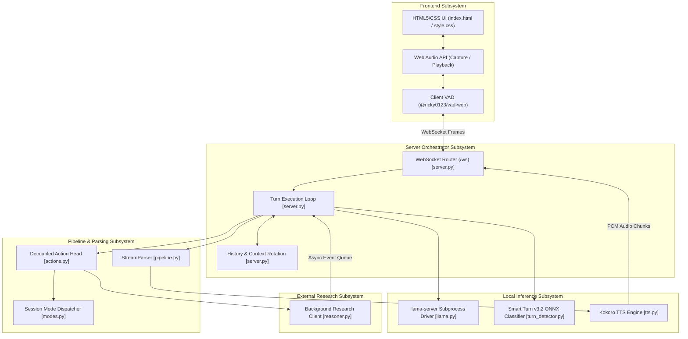
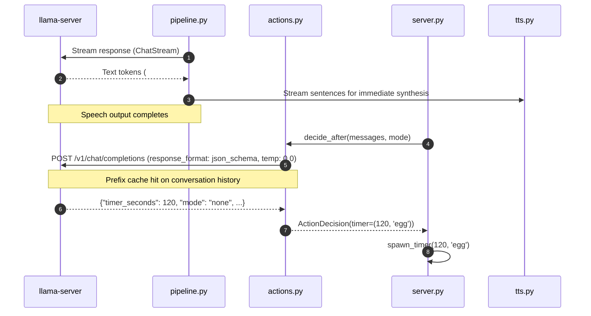
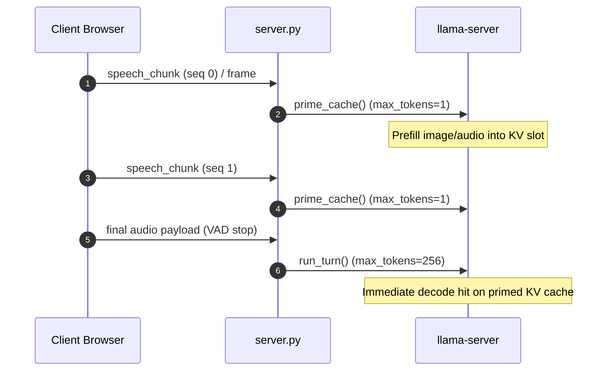

# Architecture Specification — Parlor

This document details the software architecture, component boundaries, execution models, and core design decisions of the **Parlor** real-time multimodal voice/vision assistant.

---

## 1. System Component Overview

Parlor is organized into five primary architectural subsystems:

---

## 2. Component Responsibilities

| Component | File Path | Primary Responsibilities |
| :--- | :--- | :--- |
| **Server Orchestrator** | [server.py](file:///c:/Users/fadzw/parlor/src/parlor/server.py) | Manages FastAPI server lifecycle, WebSocket endpoint `/ws`, event queue (`msg_queue`), active timers (`pending_timers`), context rotation (`rotate_history`), and session mode switching. |
| **Pipeline Core** | [pipeline.py](file:///c:/Users/fadzw/parlor/src/parlor/pipeline.py) | Orchestrates pipelined execution (`run_turn`), handles tail-silence padding (`pad_tail_silence`), incremental text/transcript parsing (`StreamParser`), and speculative prompt-cache priming (`prime_cache`). |
| **Action Decider** | [actions.py](file:///c:/Users/fadzw/parlor/src/parlor/actions.py) | Executes a secondary grammar-forced JSON request (`decide_after` / `decide_before`) to detect user intent (timers, mode changes, web search) without generating in-band text tags. |
| **Inference Driver** | [llama.py](file:///c:/Users/fadzw/parlor/src/parlor/llama.py) | Manages `llama-server` process creation, version compliance checks (`check_build`), HuggingFace GGUF model downloads (`resolve_model_paths`), SSE response parsing (`ChatStream`), and blocking REST requests. |
| **Turn Detector** | [turn_detector.py](file:///c:/Users/fadzw/parlor/src/parlor/turn_detector.py) | Computes Whisper-style log-mel features (`compute_whisper_log_mel_features`) and runs `smart-turn-v3.2` ONNX model to score turn completion probability (`predict`). |
| **TTS Engine** | [tts.py](file:///c:/Users/fadzw/parlor/src/parlor/tts.py) | Abstract interface (`TTSBackend`) with platform-specific implementations: `MLXBackend` (Apple Silicon MLX) and `ONNXBackend` (CPU ONNX Runtime). |
| **Background Reasoner**| [reasoner.py](file:///c:/Users/fadzw/parlor/src/parlor/reasoner.py) | Handles web research delegation by querying external OpenAI-compatible APIs (e.g. OpenRouter) with conversational system prompts. |
| **Session Modes** | [modes.py](file:///c:/Users/fadzw/parlor/src/parlor/modes.py) | Defines immutable operational profiles (`conversation`, `translate`, `listen`) governing turn gating, delegation, camera usage, and TTS voice attributes. |
| **Web Frontend** | [app.js](file:///c:/Users/fadzw/parlor/src/parlor/web/static/app.js) | Implements client-side Silero VAD, Web Audio API ring buffers, canvas visualizers, WebSocket protocol serialization, and camera capture. |

---

## 3. Major Architectural Design Decisions

### 3.1. Decoupled Grammar-Forced JSON Action Head

**Context**: Voice assistants traditionally rely on in-band control markup (e.g. `### TIMER: 120`) emitted alongside spoken responses.

**Decision**: Parlor completely isolates action logic into a secondary JSON schema call (`src/parlor/actions.py:73-83`).

**Rationale**: Benchmarking in `benchmarks/archbench.py` revealed that in-band tags achieved 0.955 recall with spoken promises failing to execute. The decoupled head scored 1.0 recall with zero risk of reading control tags aloud. Because both requests share identical conversation history, the decider benefits from `llama-server` prefix caching, executing in ~35 tokens (~2s GPU hidden under TTS playback).

---

### 3.2. Acoustic vs. LLM End-of-Turn (EOT) Classification

**Context**: Relying on 2B–4B LLMs to judge whether audio input is complete introduces high latency and frequent misclassifications on mid-sentence speech pauses.

**Decision**: Parlor uses a dedicated 140k-parameter ONNX model (`smart-turn-v3.2`) executed locally on CPU (`src/parlor/turn_detector.py:24`).

**Rationale**: `TurnDetector.predict()` runs in 10–30ms on CPU, evaluating the last 8 seconds of 16kHz audio. If `p_complete < 0.5`, the server caches `held_audio` and notifies the client via `turn_incomplete`, allowing the user to pause mid-thought without being interrupted by assistant generation.

---

### 3.3. Speculative Prompt-Cache Priming

**Context**: High initial prefill latency when submitting combined vision and long audio messages to `llama-server`.

**Decision**: Implement `prime_cache()` (`src/parlor/pipeline.py:464`).

**Rationale**: As the user speaks, 3-second audio chunks and camera frames are pushed to `llama-server` with `max_tokens=1`. When the final VAD turn boundary fires, `llama-server` only evaluates the tail tokens of the utterance, reducing time-to-first-audio (TTFA) to 0.6s–1.0s on Apple Silicon hardware.

---

## 4. Operational Boundaries and Constraints

1. **Single-Slot Context Bound**: `llama-server` is launched with `-np 1` (`src/parlor/llama.py:145`). The server is strictly single-tenant; parallel WebSocket sessions will cause context eviction and corrupted history state.
2. **Context Window Header Room**: Context size defaults to `LLAMA_CTX=16384` (`src/parlor/llama.py:36`). `rotate_history()` automatically truncates the oldest 25% of user/assistant exchanges when token usage exceeds `LLAMA_CTX - 2 * CONTEXT_HEADROOM` (`src/parlor/server.py:614`).
3. **Platform TTS Routing**:
   - `sys.platform == "darwin"` and `arm64`: Uses `mlx-audio` (`MLXBackend`, 24kHz).
   - All other platforms (or `KOKORO_ONNX=1`): Uses `kokoro-onnx` (`ONNXBackend`, 24kHz CPU).

---

## 5. Architectural Concerns & Edge Cases

* **Voice Echo Loops**: If speaker output bleeds into the microphone, `StreamParser` and `echoes_instruction()` filter out instruction repetitions (`src/parlor/pipeline.py:234`).
* **Silent Turn Fallbacks**: If the LLM generates only a transcript line without a response body, `run_turn()` injects a fallback message (`FLUSH_FALLBACK` / `AUDIO_FALLBACK`) to ensure audio output is delivered (`src/parlor/pipeline.py:418`).
* **Non-Blocking Thread Pools**: External HTTP calls (`reasoner.py`) are strictly executed inside a dedicated `ThreadPoolExecutor` (`REASONER_POOL`, `src/parlor/server.py:294`) to prevent stalling the main asyncio event loop.
