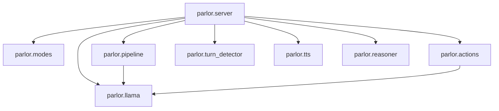

# Dependency Analysis — Parlor

This document details all internal module relationships, Python package dependencies, native binaries, ML model weights, and frontend libraries required by **Parlor**.

---

## 1. Internal Module Dependency Graph

---

## 2. Python Package Dependencies (`pyproject.toml`)

| Package Name | Version Specifier | Platform Constraint | Purpose & Rationale |
| :--- | :--- | :--- | :--- |
| **`fastapi`** | `>=0.135.3` | All | Asynchronous web framework hosting static frontend assets and the primary WebSocket protocol endpoint (`/ws`). |
| **`uvicorn[standard]`** | `>=0.43.0` | All | High-performance ASGI server executing the FastAPI application. |
| **`websockets`** | `>=16.0` | All | Enables real-time binary audio chunk and text frame streaming between browser client and server. |
| **`numpy`** | `>=2.4.4` | All | Performant array operations for 16kHz audio manipulation, log-mel spectrogram computation, and int16 PCM conversion. |
| **`pillow`** | `>=11.0.0` | All | Python Imaging Library (PIL) dependency supporting image processing routines. |
| **`soundfile`** | `>=0.13.1` | All | Read/write support for WAV audio files and raw PCM memory buffers. |
| **`huggingface-hub`**| `>=1.0.0` | All | Automated downloading and local caching of GGUF models, mmproj visual projections, and ONNX weights. |
| **`onnxruntime`** | `>=1.24.4` | All | CPU-optimized execution engine for `smart-turn-v3.2` end-of-turn classification and Kokoro TTS on non-macOS systems. |
| **`python-dotenv`** | `>=1.0.0` | All | Environment variable management loading configuration from local `.env` files. |
| **`mlx-audio`** | `>=0.4.2` | `sys_platform == 'darwin'` | Apple Silicon MLX GPU acceleration for Kokoro TTS synthesis. |
| **`misaki[en]`** | `>=0.9.4` | `sys_platform == 'darwin'` | Grapheme-to-phoneme (G2P) text processing required by Kokoro synthesis pipelines on macOS. |
| **`num2words`** | `>=0.5.14` | `sys_platform == 'darwin'` | Number-to-words expansion for TTS text normalization. |
| **`kokoro-onnx`** | `>=0.5.0` | `sys_platform == 'linux'` | CPU-based ONNX implementation of Kokoro TTS synthesis for Linux and Windows. |
| **`pytest`** | `>=8.4` | Dev | Automated test framework execution. |

---

## 3. External Native Binaries & Hardware Dependencies

### 3.1. `llama.cpp` / `llama-server`
* **Type**: External Native Binary (C/C++ CUDA/Metal executable).
* **Requirement**: `llama-server` or `llama` binary available in system `$PATH` (`src/parlor/llama.py:97`).
* **Version Floor**: `MIN_BUILD = 9503` (June 2026 build floor required for Gemma 4 audio support; 12B requires build `9512+`) (`src/parlor/llama.py:84`).
* **Purpose**: Hosts local quantized GGUF multimodal LLMs (`e2b`, `e4b`, `12b`), processing audio/text tokens, maintaining KV slot caches, and providing an OpenAI-compatible REST API.

---

## 4. Machine Learning Weights & Model Registry

| Model Name | HuggingFace Repository | Filename / Asset | Role |
| :--- | :--- | :--- | :--- |
| **Gemma 4 E2B** | `google/gemma-4-E2B-it-qat-q4_0-gguf` | `gemma-4-E2B_q4_0-it.gguf` `gemma-4-E2B-it-mmproj.gguf` | Ultra-fast local voice/vision LLM (~0.6s TTFA). |
| **Gemma 4 E4B** | `google/gemma-4-E4B-it-qat-q4_0-gguf` | `gemma-4-E4B_q4_0-it.gguf` `gemma-4-E4B-it-mmproj.gguf` | Default balanced local voice/vision LLM (~1.0s TTFA). |
| **Gemma 4 12B** | `google/gemma-4-12B-it-qat-q4_0-gguf` | `gemma-4-12b-it-qat-q4_0.gguf` `mmproj-gemma-4-12b-it-qat-q4_0.gguf` | High-accuracy local voice/vision LLM (~8GB VRAM). |
| **Smart Turn v3.2** | `pipecat-ai/smart-turn-v3` | `smart-turn-v3.2-cpu.onnx` | Acoustic 140k ONNX end-of-turn classifier. |
| **Kokoro ONNX** | `fastrtc/kokoro-onnx` | `kokoro-v1.0.onnx` `voices-v1.0.bin` | CPU Text-to-Speech synthesis model. |
| **Kokoro MLX** | `mlx-community/Kokoro-82M-bf16` | Weights auto-resolved | Apple Silicon Metal GPU Text-to-Speech model. |

---

## 5. Web Frontend Dependencies (`index.html`)

| Library Name | Version | Loading Mechanism | Purpose |
| :--- | :--- | :--- | :--- |
| **ONNX Runtime Web** | `1.22.0` | CDN (`jsdelivr`) | Client-side web assembly execution of ONNX models. |
| **VAD Web (`@ricky0123/vad-web`)** | `0.0.29` | CDN (`jsdelivr`) | Client-side Silero Voice Activity Detection for browser microphone audio segmentation. |
| **Google Fonts (Instrument Sans)** | N/A | CDN (`fonts.googleapis.com`) | Interface typography styling (`src/parlor/web/index.html:9`). |

---

## 6. Third-Party Service Dependencies

* **OpenRouter / OpenAI API**: Optional cloud endpoint (`https://openrouter.ai/api/v1`) queried via standard HTTP when `REASONER_API_KEY` is present in `.env` to execute background web research (`src/parlor/reasoner.py:17`).
