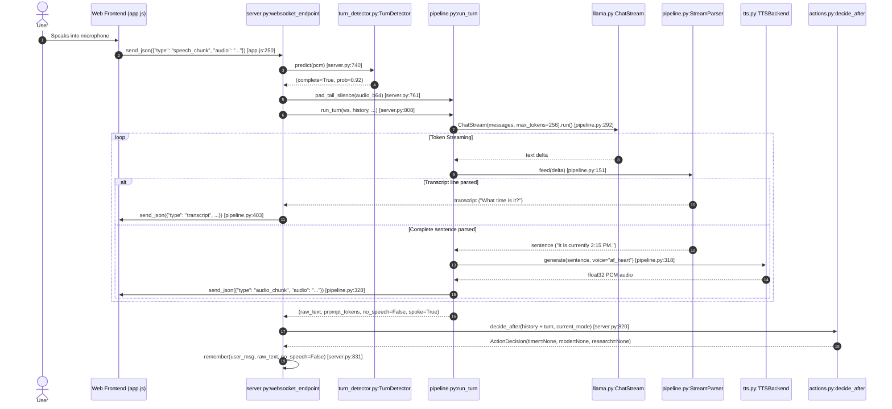
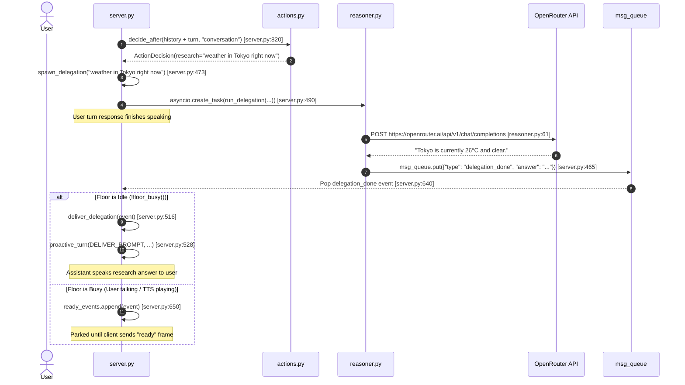

# Execution Flow Documentation — Parlor

This document traces the step-by-step execution paths for primary user and system workflows in **Parlor**, providing concrete file and function references.

---

## 1. Standard Multimodal Conversational Turn Execution

**Trigger**: Client VAD detects the end of user speech and sends an audio WebSocket message (`type: "speech_chunk"` or `type: "audio"`).



### Traceability Index:
* Audio Extraction & Check: [server.py:704](file:///c:/Users/fadzw/parlor/src/parlor/server.py#L704) (`valid_audio()`)
* Tail Silence Padding: [pipeline.py:91](file:///c:/Users/fadzw/parlor/src/parlor/pipeline.py#L91) (`pad_tail_silence()`)
* Turn Pipelining: [pipeline.py:263](file:///c:/Users/fadzw/parlor/src/parlor/pipeline.py#L263) (`run_turn()`)
* SSE Processing: [llama.py:224](file:///c:/Users/fadzw/parlor/src/parlor/llama.py#L224) (`ChatStream.run()`)
* Sentence TTS Synthesis: [pipeline.py:318](file:///c:/Users/fadzw/parlor/src/parlor/pipeline.py#L318) (`tts_backend.generate()`)

---

## 2. Acoustic Turn Gating & Hold/Flush Flow

**Trigger**: User pauses mid-thought during speech (`p_complete < 0.5`).

```text
Client Audio Segment
 ↓
TurnDetector.predict(pcm) [server.py:740]
 ↓
Returns: complete = False, prob = 0.35
 ↓
server.py stores audio: held_audio = audio_b64s [server.py:745]
 ↓
ws.send_json({"type": "turn_incomplete", "p_complete": 0.35}) [server.py:751]
 ↓
prime_cache(history + held_audio) [server.py:754]
 ↓
Client stays silent (VAD flush timer expires after ~2s)
 ↓
Client sends: {"type": "flush"} [app.js:290]
 ↓
server.py receives flush message → skips SmartTurn check [server.py:737]
 ↓
run_turn() executes with FLUSH_PROMPT [server.py:808]
```

### Traceability Index:
* Turn Completeness Gating: [server.py:737-756](file:///c:/Users/fadzw/parlor/src/parlor/server.py#L737-L756)
* Audio Segment Holding: [server.py:745](file:///c:/Users/fadzw/parlor/src/parlor/server.py#L745)
* Flush Prompt Construction: [server.py:222](file:///c:/Users/fadzw/parlor/src/parlor/server.py#L222) (`FLUSH_PROMPT`)

---

## 3. Speculative Cache Priming Flow

**Trigger**: Client sends intermediate speech chunks (`seq > 0`) or webcam frames (`type: "frame"`) while user is actively speaking.

```text
Client captures webcam image frame
 ↓
Client sends: {"type": "frame", "image": "<b64_jpeg>"} [app.js:180]
 ↓
server.py stores: frame_image = msg["image"] [server.py:696]
 ↓
server.py calls: prime(held_audio) [server.py:698]
 ↓
pipeline.py: prime_cache(messages) [pipeline.py:464]
 ↓
llama.py: chat_blocking(messages, max_tokens=1) [pipeline.py:472]
 ↓
llama-server computes image embeddings & caches KV prefix
 ↓
User finishes speaking → final turn request arrives
 ↓
llama-server hits primed KV cache, evaluating only tail audio tokens
```

### Traceability Index:
* Frame Receiver: [server.py:694-699](file:///c:/Users/fadzw/parlor/src/parlor/server.py#L694-L699)
* Speech Chunk Receiver: [server.py:701-708](file:///c:/Users/fadzw/parlor/src/parlor/server.py#L701-L708)
* Cache Priming Executor: [pipeline.py:464-476](file:///c:/Users/fadzw/parlor/src/parlor/pipeline.py#L464-L476) (`prime_cache()`)

---

## 4. Background Research Delegation & Proactive Delivery Flow

**Trigger**: User utters a current-info or web search query (e.g. "What's the weather in Tokyo right now?").



### Traceability Index:
* Action Decider Search Restatement: [actions.py:47-49](file:///c:/Users/fadzw/parlor/src/parlor/actions.py#L47-L49)
* Delegation Task Spawner: [server.py:473-493](file:///c:/Users/fadzw/parlor/src/parlor/server.py#L473-L493) (`spawn_delegation()`)
* External HTTP Request: [reasoner.py:48-77](file:///c:/Users/fadzw/parlor/src/parlor/reasoner.py#L48-L77) (`ask()`)
* Proactive Delivery Turn: [server.py:494-515](file:///c:/Users/fadzw/parlor/src/parlor/server.py#L494-L515) (`proactive_turn()`)

---

## 5. Countdown Timer Flow

**Trigger**: User requests a countdown timer (e.g. "Set an egg timer for 3 minutes").

```text
User Speech Turn
 ↓
actions.decide_after() -> ActionDecision(timer=(180, "egg")) [server.py:820]
 ↓
server.py calls: spawn_timer(180, "egg") [server.py:539]
 ↓
Creates async task: run_timer(timer_id, "egg", 180) [server.py:549]
 ↓
ws.send_json({"type": "timer_started", "id": 1, "label": "egg", "seconds": 180})
 ↓
asyncio.sleep(180) expires [server.py:535]
 ↓
Pushes to queue: msg_queue.put({"type": "timer_done", ...}) [server.py:536]
 ↓
deliver_timer() -> proactive_turn(TIMER_PROMPT, TIMER_FALLBACK) [server.py:581]
 ↓
TTS speaks: "Ding — your egg timer is done." [server.py:131]
```

### Traceability Index:
* Timer Schema: [actions.py:76-77](file:///c:/Users/fadzw/parlor/src/parlor/actions.py#L76-L77)
* Timer Task Creation: [server.py:539-553](file:///c:/Users/fadzw/parlor/src/parlor/server.py#L539-L553) (`spawn_timer()`)
* Timer Ring Delivery: [server.py:581-591](file:///c:/Users/fadzw/parlor/src/parlor/server.py#L581-L591) (`deliver_timer()`)
